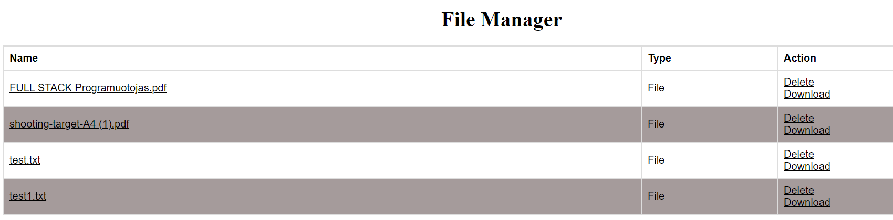

# File Manager

Hi! This is my PHP Sprint 1 called ***File Manager.*** Read description below.
## File Manager features

 - Possibility to log in with these credentials :

> Username: admin
> Password: 1234

 - Creating new folder;
 - Uploading new files;
 - Downloading files;
 - Log out option;
 ## How to use File Manager
 1. Login with **username** and **password**
 
 
 
 2. Creating a new folder ( enter folder name and click **Create Folder** button );
 
 
 
 3. Uploading files ( choose file and click **Upload** button, files will be saved to **Uploads** folder;
 
 
 
 
 
 4. Downloading files ( open **Uploads** folder and click Download button );
 
 
 
 5. Click **Log Out** button to log out.
 
 
 ## Thank you!
